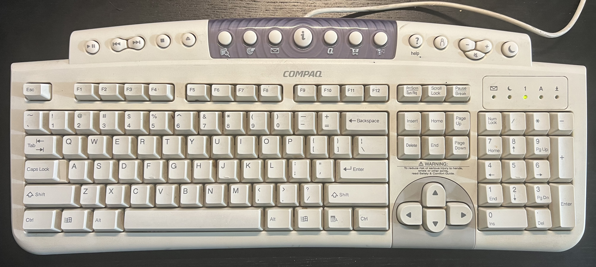

# About

This is a Linux keyboard driver for the Compaq SDM4540UL 'Internet Keyboard'.



On Linux, there are 9 keys on the keyboard that aren't supported by the kernel, these are:

* The 7 keys in the "blue" area: Search, Bullseye, Mail, Info, Q, e-marketplace, movies/music
* The 2 keys to the right of that: '?' help, person/contacts

This keyboard driver maps those 'dead' keys to function keys:

| Original key name/description | New key mapped to |
|-------------------------------|-------------------|
| Search                        | F13               |
| Bullseye/target               | F14               |
| Mail/Envelope                 | F15               |
| Info/'i'                      | F16               |
| Compaq 'Q' logo               | F17               |
| Online marketplace            | F18               |
| Movies/Music                  | F19               |
| Help '?'                      | F20               |
| Contacts/Person               | F21               |

# Usage

## Pre-requisites

Install the header files for your kernel:

```bash
$ sudo apt install linux-headers-$(uname -r)
```

Run `make` in the root of the repository to build the kernel module.

Now load the kernel module:

```bash
$ sudo insmod hid-compaq-sdm4540ul.ko
```

When you're done using the device, you can do:

```bash
$ sudo rmmod hid-compaq-sdm4540ul.ko
```